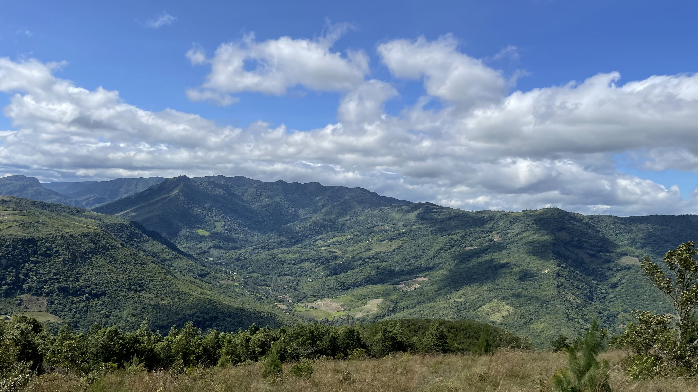

Hey there 👋🏽

I’m Juan Pablo, a junior backend engineer. I am interested in improving my skills as a programmer as well as learning new tools, frameworks and methodologies to work in a team.

## &#x1f4c8; GitHub Stats

 

 
 

## 💼 Skills

More Skills

 

 

 

 
